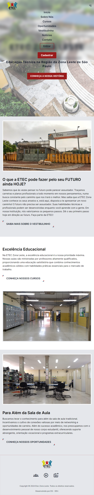

<div align="center">
  <a href="https://www.eteczonaleste.com.br/" target="_blank" title="Site oficial da Etec Zona Leste">
    
  </a>
</div>

<div align="center">
  
  
    
</div><br />

<div align="center">
  <h1>PROJETO LARAVEL SITE ETEC ZL</h1>
</div>

### Este projeto Laravel foi desenvolvido como parte da atividade para criação de um website baseado no site oficial da Etec Zona Leste com rotas e páginas. O objetivo é criar um aplicativo web simples com algumas seções.

## Visão Geral do Projeto

O projeto visa estabelecer uma estrutura básica para um aplicativo web usando o framework Laravel. Ele inclui a configuração inicial do Laravel, definição de rotas para cada seção e criação de visualizações para cada página.

## Pré-requisitos

- PHP instalado na sua estação de trabalho.
- Ambiente de desenvolvimento local ligado (MAMP, WAMP, XAMPP, Docker, entre outros).
- Composer instalado.

## Criação de um Novo Projeto Laravel

Para começar, crie um novo projeto Laravel executando os seguintes comandos no terminal:

**Instale o Laravel usando o Composer.**
```bash
composer create-project laravel/laravel nome-do-seu-projeto
```

**Navegue até o diretório do seu projeto recém-criado.**
```bash
cd nome-do-seu-projeto
```

## Instalação de Laravel Breeze

Dentro do diretório do seu projeto Laravel, execute o seguinte comando para instalar o Laravel Breeze:

```bash
composer require laravel/breeze --dev
```

## Configuração da Autenticação

Após a instalação do Laravel Breeze, execute os seguintes comandos para configurar a autenticação:

**Instale as views e rotas necessárias para autenticação.**
```bash
php artisan breeze:install
```

**Execute as migrações para criar as tabelas de banco de dados necessárias.**
```bash
php artisan migrate
```

## Configuração do Front-End

Para acessar e interagir com o aplicativo no navegador é necessário que o front-end esteja em execução. Portanto abra outro terminal dentro do diretório do seu projeto Laravel e execute os seguintes comandos:

**Isso instalará todas as dependências JavaScript necessárias para o seu projeto Laravel.**
```bash
npm install
```

**Isso compilará os recursos frontend, como arquivos JavaScript e CSS, para que seu aplicativo possa usá-los corretamente.**
```bash
npm run dev
```

## Inicialização do Servidor Local

Para visualizar o aplicativo em execução, inicie o servidor local executando o seguinte comando no terminal dentro do diretório do seu projeto Laravel:

```bash
php artisan serve
```

## Acessar o Aplicativo

Após inicializar o servidor local, copie ou clique no endereço http disponibilizado, e abra seu navegador para acessar as páginas de login e registro.

## Criação do Controlador no Laravel

Este controlador será salvo no diretório app/Http/Controllers e será utilizado para definir a lógica de manipulação das requisições relacionadas as páginas do seu aplicativo web.

**Criação do Controlador da página Principal.**
```bash
php artisan make:controller PrincipalController
```

**Conteúdo do PrincipalController.php.**
```php
<?php

namespace App\Http\Controllers;

use App\Http\Controllers\Controller;

class PrincipalController extends Controller {
    public function principal(){
        return view('site.principal');
    }
}
```
## Criação de rotas

Adicione as rotas para as páginas desejadas dentro do diretório routes/web.php.

```php
<?php

use Illuminate\Support\Facades\Route;

Route::get('/', 'App\Http\Controllers\PrincipalController@principal')->name('site.index');
```

## Listar rotas

**Lista todas as rotas registradas na aplicação.**
```bash
php artisan route:list
```

## Criação do diretório site dentro do diretório resources/views

O diretório servirá para conter o arquivo:
- principal.blade.php

Adicione o conteúdo HTML, Tailwind CSS, desejado em cada arquivo Blade para definir o layout das páginas.

```html
<!DOCTYPE html>
<html lang="pt-br">

<head>
    <meta charset="UTF-8">
    <meta http-equiv="X-UA-Compatible" content="IE=edge">
    <meta name="viewport" content="width=device-width, initial-scale=1.0">

    <!-- Tailwind. -->
    @vite('resources/css/app.css')

    <link rel="stylesheet" href="https://fonts.googleapis.com/css2?family=Material+Symbols+Outlined:opsz,wght,FILL,GRAD@24,400,0,0" />

    <title>Início - ETEC Zona Leste</title>
</head>

<style>
    @import url('https://fonts.googleapis.com/css2?family=Inter:wght@100..900&display=swap');

    :root {
        font-family: "Inter", sans-serif;

        --primary: #0d6d94;
        --secondary: #040404;
        --terceary: #fdfdfd;
        --quaternary: #247c94;
        --quinary: #bc0505;
        --sextary: #dcd406;
    }

    /* Outros estilos CSS aqui. */
</style>

<body>
  <nav class="bg-white bg-opacity-5 backdrop-filter backdrop-blur-md border border-opacity-10 border-white p-4 fixed top-0 left-0 w-full z-40">
    <!-- Conteúdo do menu de navegação. -->
  </nav>

  <!-- Hero. -->
  <section class="relative flex flex-col justify-center font-[Inter] px-12 py-8 pt-30 z-30" style="height: 100vh">
    <!-- Conteúdo da seção hero. -->
  </section>

  <!-- Outras seções. -->

  <footer class="bg-gray-200 border border-opacity-10 border-t-4 border-red-800 text-gray-900 pt-10 pb-5">
    <!-- Conteúdo do rodapé. -->
  </footer>

</body>

</html>
```

## Ilustrações da página início 




## Licença

Este projeto está licenciado sob a [MIT license](https://opensource.org/licenses/MIT).